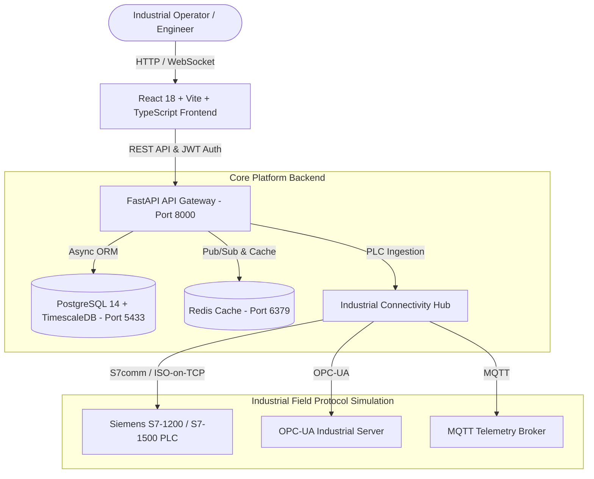

# 🏭 PlantTwin AI™ — Industrial Digital Twin & Autonomous SCADA Operations Platform

[](https://fastapi.tiangolo.com)
[](https://reactjs.org)
[](https://www.typescriptlang.org)
[](https://tailwindcss.com)
[](https://www.postgresql.org)
[](https://www.timescale.com)
[](https://www.docker.com)
[](#standards--compliance)

> **PlantTwin AI™** is a enterprise-ready, industrial-grade **Digital Twin, Real-Time Telemetry Historian, and AI Predictive Maintenance Platform**. Built specifically for continuous process manufacturing, chemical refineries, power generation facilities, and smart factories.

## 📄 Solution Flyers & Product Collateral

- 🔴 **PlantTwin AI Master Solution Flyer (HTML)**: [PlantTwin_AI_Solution_Flyer.html](PlantTwin_AI_Solution_Flyer.html) *(Built using exact AeroInspect AI solution flyer structure & titles)*
- 🔵 **GenAI Copilot Agent Solution Flyer (HTML)**: [PlantTwin_Copilot_Agent_Flyer.html](PlantTwin_Copilot_Agent_Flyer.html) *(Gemini LLM, P&ID Vector RAG, and live tag query agent flyer)*
- 🟡 **Predictive Maintenance Agent Solution Flyer (HTML)**: [PlantTwin_Predictive_Agent_Flyer.html](PlantTwin_Predictive_Agent_Flyer.html) *(XGBoost RUL, SHAP XAI, and 14-day failure prediction flyer)*

## 📊 Tech Stack & Dependencies Deliverable

- 📊 **Tech Stack & Dependencies Excel Sheet (.xlsx)**: [PlantTwin_AI_Tech_Stack_and_Dependencies.xlsx](PlantTwin_AI_Tech_Stack_and_Dependencies.xlsx) *(Complete 4-sheet workbook detailing all backend, frontend, infrastructure, and hardware dependencies)*

---

## 🌟 Executive Key Features

- 🌳 **ISA-95 Hierarchy Topology**: Full Enterprise → Site → Area → Production Line → Machine Equipment → Sensor Tag modeling.
- ⚙️ **Equipment & Asset Management**: GIS spatial positioning maps, dynamic P&ID process flow diagram rendering, and asset lifecycle tracking.
- 📈 **Live SCADA Telemetry & Historian**: Real-time high-frequency telemetry streaming with scatter correlation charts, replay scrubbers, and TimescaleDB hypertable storage.
- 🚨 **ISA-18.2 Alarm Operations & Rule Engine**: Alarm lifecycle management (Unacknowledged, Acknowledged, Shelved, Cleared) with interactive alarm evaluation modal.
- 🤖 **AI Predictive Intelligence Platform**: 7 core capabilities including RUL (Remaining Useful Life) estimation, bearing fault signature analysis, anomaly detection, and automated root-cause recommendation.
- 📋 **Work Orders & Maintenance Lifecycle**: End-to-end work order creation pipeline with persistent storage and role-based action guards.
- 📊 **Reporting & Analytics Engine**: Automated PDF report generator (PDF-1.4 format), executive KPI summary cards, and custom CSV exports.
- 🔔 **Enterprise Notification Center**: Multi-channel notifications (In-App, Email, SMS, Webhooks) with automated 3-tier escalation matrices.
- 🔌 **Industrial SCADA Connectivity Hub**: Multi-protocol protocol drivers (Siemens S7-1200/1500 PLCSIM, OPC-UA, MQTT, Modbus TCP, REST API, CSV Ingestion).
- 🛡️ **Security, Governance & Audit Trail**: SOC-2 & ISA-99 compliant append-only audit stream tracking all PLC memory writes and administrative interventions.
- 🎨 **Dynamic Multi-Theme Engine**: 6 curated high-contrast themes (**Industrial Dark**, **Dark Slate**, **Enterprise Light**, **Siemens SCADA Teal**, **Midnight Purple**, **High Contrast**).

---

## 🏗️ System Architecture



---

## ⚡ Quick Start & Setup Guide

### Option 1: Docker Compose (Recommended for Production)

```bash
# 1. Clone the repository
git clone https://github.com/your-username/planttwin-ai-platform.git
cd planttwin-ai-platform

# 2. Launch the entire containerized stack (Frontend, Backend, PostgreSQL, Redis)
docker-compose up -d --build

# 3. Access the platform
# Frontend Web App: http://localhost:3000
# Backend Swagger API Docs: http://localhost:8000/docs
```

### Option 2: Local Development Setup

#### Backend (FastAPI & Python 3.10+)

```bash
cd planttwin-backend

# Create virtual environment
python -m venv venv
source venv/bin/activate  # On Windows: venv\Scripts\activate

# Install dependencies
pip install -r requirements.txt

# Run FastAPI server
uvicorn app.main:app --reload --host 127.0.0.1 --port 8000
```

#### Frontend (React 18 & Vite)

```bash
cd planttwin-frontend

# Install dependencies
npm install

# Start Vite development server
npm run dev
```

---

## 🔐 Demo User Credentials & Persona Matrix

The system includes pre-configured persona profiles for live demonstration:

| Persona | Email | Password | Role Access Level |
| :--- | :--- | :--- | :--- |
| **System Administrator** | `admin@apex.com` | `AdminPassword123!` | Full Admin & Governance Privileges |
| **Plant Manager** | `plant.manager@planttwin.ai` | `ManagerPassword123!` | Operational & Reporting Access |
| **Reliability Engineer** | `engineer@planttwin.ai` | `EngineerPassword123!` | AI Models & Telemetry Analysis |
| **Control Operator** | `operator@planttwin.ai` | `OperatorPassword123!` | SCADA Ticker & Alarm Acknowledgment |

---

## 🌐 API Endpoints Reference

| Category | Endpoint | Method | Description |
| :--- | :--- | :---: | :--- |
| **Health** | `/api/v1/health` | `GET` | System operational health status |
| **Auth** | `/api/v1/identity/auth/login` | `POST` | Authenticate user & issue signed JWT tokens |
| **Users** | `/api/v1/identity/users` | `GET` | User roster & RBAC role matrix |
| **Organizations** | `/api/v1/enterprise/organizations` | `GET` | Multi-tenant organization list |
| **Plants** | `/api/v1/enterprise/plants` | `GET` | ISA-95 plant hierarchy topology |
| **Assets** | `/api/v1/assets/equipment` | `GET` | Equipment inventory & sensor tags |
| **Alarms** | `/api/v1/runtime/alarms/active` | `GET` | Active ISA-18.2 alarm stream |
| **Work Orders** | `/api/v1/runtime/work-orders` | `GET / POST` | Maintenance work orders CRUD |
| **Notifications** | `/api/v1/notifications/center` | `GET` | Enterprise notification stream |

---

## 📜 Standards & Compliance

- **ISA-95**: Enterprise-Control System Integration (Level 0 through Level 4).
- **ISA-18.2**: Management of Alarm Systems for Process Industries.
- **SOC-2 Type II**: Security, Availability, and Confidentiality controls.
- **IEC 62443 / ISA-99**: Industrial Communication Networks Network and System Security.

---

## 📄 License

Distributed under the **Commercial Enterprise License** / **MIT License**. See `LICENSE` for more information.

---
